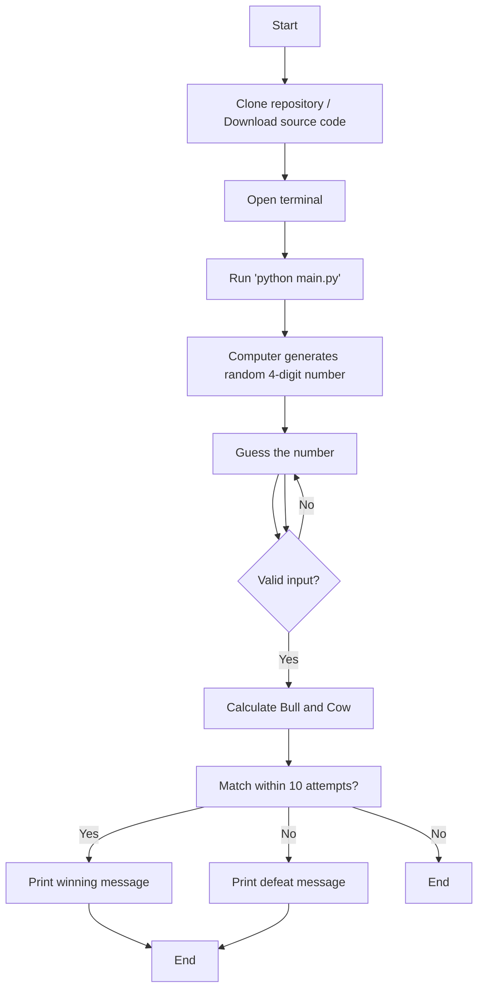

# Bulls And Cows Game

숫자 야구 게임.
랜덤한 4자리 숫자를 생성하고, 플레이어는 10번의 시도 안에 숫자를 맞춰야 한다.

## How to Play

1. 이 저장소를 클론하거나 소스코드를 다운로드하고 압축을 푼다.
   
2. 터미널을 열고 파일이 저장된 디렉토리로 이동한다.
   
3. `python main.py` 명령어를 실행한다.
   
4. 컴퓨터가 랜덤한 4자리 숫자를 생성한다.
   
5. 숫자를 추측한다.
   
6.  입력값이 4자리 숫자가 아닌 경우, 프로그램은 유효한 입력을 하도록 요구한다.
   
7.  프로그램은 추측에 대한 Bull과 Cow를 계산하고 표시한다.
  7-1. Bull은 숫자와 자리가 모두 맞는 경우이다.
  7-2. Cow는 숫자만 맞는 경우이다.

8. 10번의 시도 안에 숫자를 맞추어야 한다.

9. 10번의 시도 안에 숫자를 맞추면 승리 메시지를 출력한다.

10.  10번의 시도 안에 숫자를 맞추지 못하면 패배 메시지를 출력한다.

